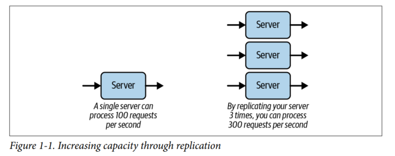
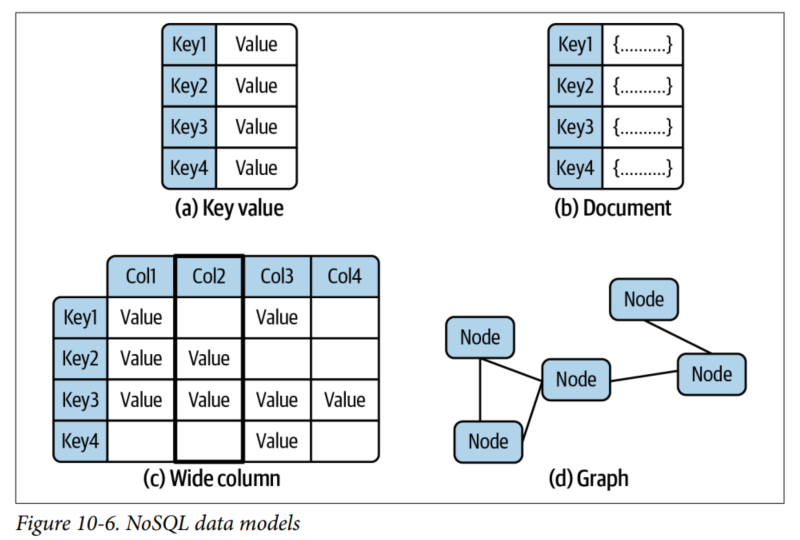

# Notes about '[Foundations of Scalable Systems](https://www.goodreads.com/book/show/61046500-foundations-of-scalable-systems)'

## What is scalability?
It defines a software system's capability to handle growth in some dimensions of its operations, like:
* The number of simultaneous users ir external requests the system can process;
* The amount of data a system can process and manage effectively;
* The ability to maintain a stable response time as the request load grows.

## Scalability Basic Design Principles
The basic aim of scaling a system is to increase its capacity in some application specific dimension.
To increase the system's throughput we usually use next principles: replication and optimization.
1. Replication. We basically replicate the software processing resources to provide more
capacity to handle requests and thus increase throughput.\

2. Optimization. Often this means using more efficient algorithms, adding extra
indexes in our databases to speed up queries, or even rewriting our server in a
faster programming language.

## Scale out
Fundamental elements required by design:
* Load balancer;
* Stateless services.

Why scaling out is attractive:
* Fast replica deployment;
* Resilient to failure, because if a server dies your request can be redirected to anhother server replica,thus enhanced availability.

## Web caching
What HTTP directives control web cache lifetime:
* Cache-Control header;
* Expires header;
* Last-Modified header;
* Etag.

HTTP caching and proxy caches (like [Squid](https://www.squid-cache.org/) or [Varnish](https://varnish-cache.org/)) provide powerful facilities for building scalable apps.

## Principles of microservices
Microservices should be:
1. Modeled around a business model.
2. Highly observable;
3. Hide implementation details;
4. Decentralize all the things;
5. Isolate failures;
6. Deploy independently;
7. Culture of automation.

### Cascading failures
#### Fail fast pattern
Ways to fail fast (to eliminate long service response time):
* Return an error if request takes longer than some predefined time;
* Enable throttling on a server. If required load exceeds some threshold, immediately return HTTP error.
#### Circuit breaker pattern
If a microservice starts to throw many errors, it makes sense to stop sending requests and give it some time to recover. The pattern protects the endpoints from being overwhelmed.
#### Bulkhead pattern (damage limitation)
If some endpoints use all threads due to increased load, requests to other endpoints will probably fail. With bulkhead pattern you can specify max thread count and max wait time for particular services so that other services remain functional when the system is under high pressure.

## Scalable Database Fundamentals
### Scaling Relational Databases
#### Scaling Out: Read Replicas
A common first step to increasing a database’s processing capacity is to scale out using read replicas. You configure one or more nodes as read replicas of the main database. The main database node is known as the primary, and read replicas are known as secondaries. The secondaries maintain a copy of the main database. Writes are only possible to the primary, and all changes are then asynchronously replicated to secondaries.
#### Scaling Out: Partitioning Data
Splitting up, or partitioning data in a relational database, is a technique for distributing the database over multiple independent disk partitions and database engines. Precisely how partitioning is supported is highly product-specific. In general, there are two strategies: horizontal partitioning and vertical partitioning

## NoSQL Data Models
